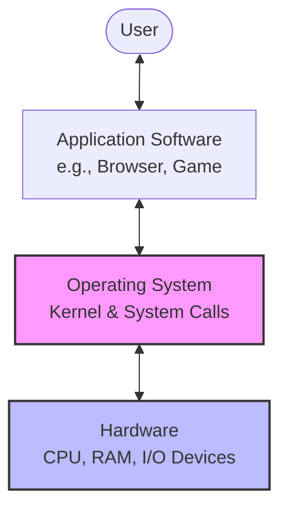
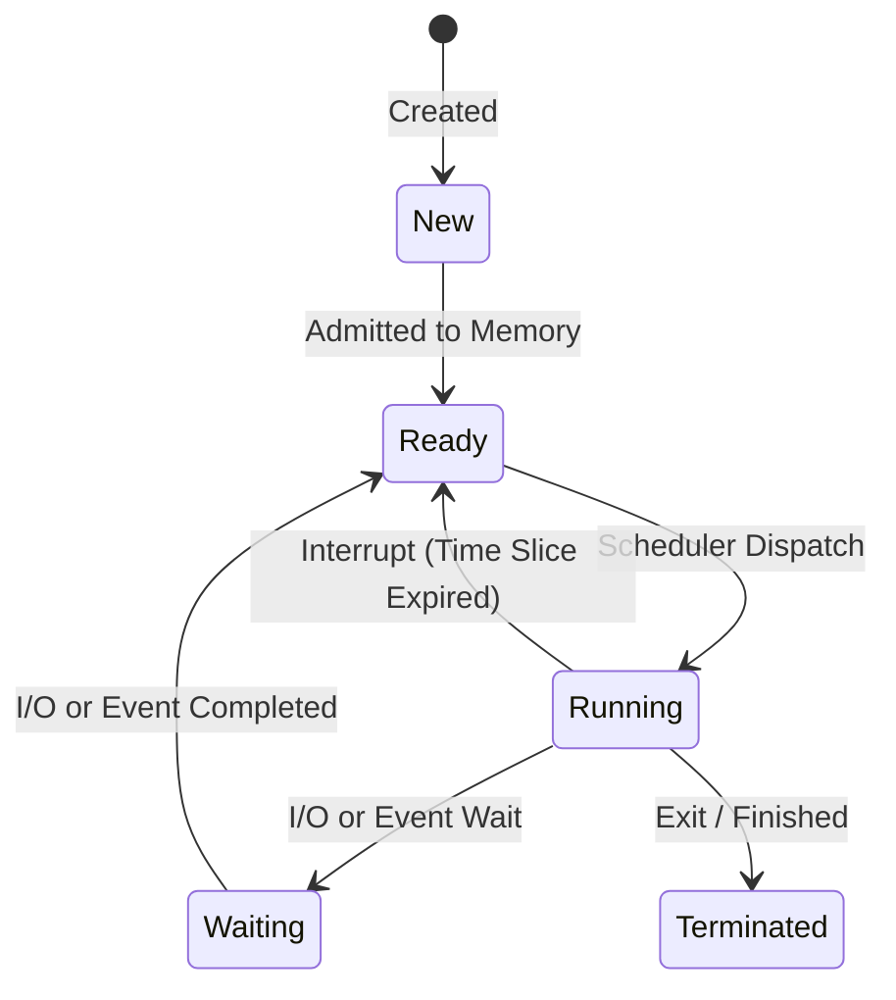
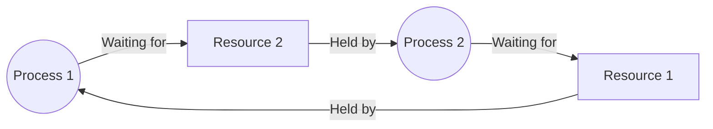
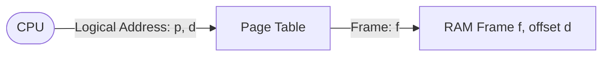
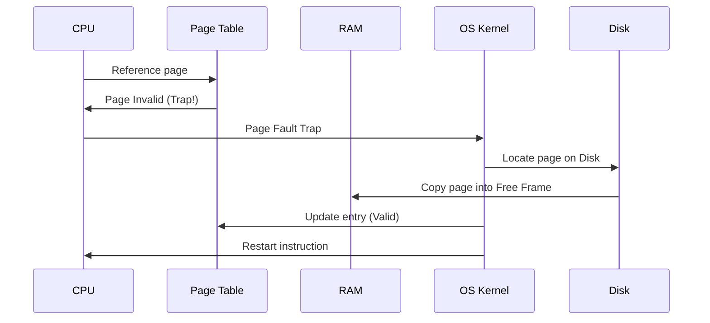

# Unit I: Operating System Basics

Welcome to Unit 1! This guide takes you from the very fundamentals of Operating Systems to advanced concepts like Process Synchronization and Memory Management. Let's make it intuitive, visual, and highly practical.

---

## 1. Conceptual Framework: What is an Operating System?

Think of a computer without an OS as a massive kitchen full of high-end appliances, but no chef. The appliances (CPU, RAM, Hard Disk) are powerful, but they don't know how to work together. 
The **Operating System (OS)** is the **Executive Chef**. It doesn't cook the food itself, but it manages who uses which stove, when the ingredients are fetched from the fridge, and how resources are shared to serve customers (users).



### 1.1 Core Objectives of an OS:
1. **Convenience**: Makes the computer user-friendly.
2. **Efficiency**: Allocates resources optimally.
3. **Evolution**: Allows easy updates of hardware/software without breaking old programs.

---

## 2. Types of Operating Systems

Operating systems have evolved based on computing needs. Here is a breakdown of the key types:

| Type of OS | Core Mechanism | Key Advantage | Major Disadvantage | Real-World Example |
| :--- | :--- | :--- | :--- | :--- |
| **Batch OS** | Groups similar jobs into "batches" and runs them sequentially without user interaction. | High CPU utilization for repetitive tasks. | No interactive debugging; slow turn-around. | Payroll systems (historic) |
| **Time-Sharing OS** | CPU executes multiple jobs by switching rapidly between them (using clock interrupts/time slices). | High responsiveness; multiple users share CPU. | Security and concurrency issues. | Linux, macOS |
| **Distributed OS** | Manages a collection of independent, networked computers, appearing as a single system. | High reliability; share loads across machines. | Complex network communication overhead. | LOCUS, Amoeba |
| **Real-Time OS (RTOS)** | High-precision timing. Jobs must complete within strict deadlines. Divided into **Hard** (strict) and **Soft** (target-based). | Guarantees response time. | Hard to program; minimal multi-tasking capacity. | Autopilot, Pacemakers, VxWorks |
| **Embedded OS** | Built into specific microcontrollers/appliances to do dedicated tasks. | Extremely lightweight and energy-efficient. | Lacks general-purpose flexibility. | Smart Fridge firmware, Android Auto |

---

## 3. Kernel & System Calls

### 3.1 Kernel: The Core
The **Kernel** is the central heart of the OS. It is loaded into main memory during booting and remains there until the computer shuts down. It runs in a highly privileged mode (often called **Supervisor Mode** or **Ring 0**).

*   **Monolithic Kernel**: All OS services (File System, Drivers, Memory, CPU Scheduling) run inside a single, large address space.
    *   *Pros*: High performance (direct function calls).
    *   *Cons*: If one driver crashes, the entire system crashes. (e.g., Linux, Unix).
*   **Microkernel**: Keeps only the bare essentials in kernel space (scheduling, IPC, low-level memory). Drivers and file systems run as user-space servers.
    *   *Pros*: Highly secure and stable (if a driver crashes, it just restarts).
    *   *Cons*: Slower due to constant context switches and message passing (e.g., MINIX, QNX).
*   **Hybrid Kernel**: Runs key services in kernel mode for speed, but uses a modular architecture (e.g., Windows NT, macOS XNU).

```mermaid
graph TD
    subgraph Monolithic Kernel
        M_Apps[User Applications]
        subgraph Kernel Space (Ring 0)
            M_VFS[File System]
            M_Sched[Scheduler]
            M_IPC[IPC]
            M_Drv[Drivers]
        )
        M_Apps <--> M_VFS
    end

    subgraph Microkernel
        U_Apps[User Applications]
        U_FS[File Server]
        U_Drv[Drivers]
        subgraph Kernel Space (Ring 0)
            Micro[Microkernel: Sched, IPC, Memory]
        end
        U_Apps <--> Micro
        U_FS <--> Micro
        U_Drv <--> Micro
    end
```

### 3.2 System Calls: The Gateway
Since application programs run in a restricted **User Mode (Ring 3)**, they cannot directly access hardware. When they need to read a file or output to a screen, they must execute a **System Call**. This triggers a software interrupt, switching the CPU to kernel mode.

**System Call Lifecycle:**
1. User program calls a wrapper library function (e.g., `printf()`).
2. Wrapper executes a trap instruction (`syscall` or `int 0x80`).
3. CPU switches from User Mode to Kernel Mode.
4. OS handles the request and switches back.

---

## 4. Processor (CPU) Scheduling Algorithms

A process goes through different stages in its life. To manage multiple processes, the OS uses a state transition model:



### 4.1 Key Scheduling Terminology
*   **Arrival Time (AT)**: Time when a process enters the Ready Queue.
*   **Burst Time (BT)**: Time CPU takes to run the process.
*   **Completion Time (CT)**: Time process finishes execution.
*   **Turnaround Time (TAT)**: Total time from arrival to completion. 
    $$\text{TAT} = \text{CT} - \text{AT}$$
*   **Waiting Time (WT)**: Time spent waiting in the ready queue.
    $$\text{WT} = \text{TAT} - \text{BT}$$

### 4.2 Algorithms Compared

1.  **First-Come, First-Served (FCFS)**: Non-preemptive. First process to arrive runs.
    *   *Issue*: **Convoy Effect** — Short processes wait behind a long-running process, ballooning average waiting time.
2.  **Shortest Job First (SJF)**: Runs the process with the shortest burst time. Can be **Non-preemptive** or **Preemptive** (Shortest Remaining Time First - SRTF).
    *   *Pro*: **Optimal** (gives the lowest average waiting time).
    *   *Issue*: **Starvation** — Long processes may never run if short ones keep arriving.
3.  **Priority Scheduling**: Runs processes based on static priorities.
    *   *Issue*: Starvation of low priority processes.
    *   *Solution*: **Aging** — Gradually increase the priority of a process as it waits.
4.  **Round Robin (RR)**: Preemptive. Each process gets a fixed time slice (**Time Quantum**). When it expires, the process is preempted and put at the end of the ready queue.
    *   *Pro*: Excellent response time for interactive systems.
    *   *Issue*: If quantum is too small, context-switching overhead kills performance. If quantum is too large, it behaves like FCFS.

---

## 5. Process Synchronization & Inter-Process Communication (IPC)

When processes share resources (variables, files, memory), they must be synchronized. Otherwise, a **Race Condition** occurs, where the output depends on the arbitrary interleaving of execution steps.

### 5.1 The Critical Section Problem
The **Critical Section (CS)** is the part of the code where shared resources are accessed. Any solution to the CS problem must satisfy three strict rules:
1.  **Mutual Exclusion**: Only one process can execute in the CS at a time.
2.  **Progress**: If no process is in CS, only those processes wishing to enter can decide who goes next. Decisions cannot be postponed indefinitely.
3.  **Bounded Waiting**: There must be a limit on the number of times other processes can enter the CS before a pending request is granted (prevents starvation).

### 5.2 Synchronization Tools

#### Semaphores
A **Semaphore** is an integer variable accessed only via two atomic operations: `wait()` (or $P$) and `signal()` (or $V$).
*   **Counting Semaphore**: Value can range over an unrestricted domain (used to manage finite resources).
*   **Binary Semaphore**: Value can only be 0 or 1.

```c
// wait(S) decrements S. If S becomes negative, the process blocks.
void wait(Semaphore S) {
    S.value--;
    if (S.value < 0) {
        add_to_waiting_queue(Process);
        block();
    }
}

// signal(S) increments S. If S <= 0, it wakes up a waiting process.
void signal(Semaphore S) {
    S.value++;
    if (S.value <= 0) {
        remove_from_waiting_queue(Process);
        wakeup(Process);
    }
}
```

#### Mutex (Mutual Exclusion Lock)
A **Mutex** is a lock that a thread acquires before entering a critical section and releases upon exiting.
*   **Key Difference from Binary Semaphore**: A Mutex has **ownership**. Only the thread that locked the Mutex can unlock it. Any thread can signal a semaphore.

---

## 6. Deadlock

A **Deadlock** occurs when a set of processes are blocked because each process is holding a resource and waiting for another resource held by some other process in the set.



### 6.1 The 4 Necessary (Coffman) Conditions
A deadlock can ONLY occur if all 4 conditions hold simultaneously:
1.  **Mutual Exclusion**: Resources must be non-shareable.
2.  **Hold and Wait**: A process must hold at least one resource and wait for others.
3.  **No Preemption**: Resources cannot be forcibly taken from a process.
4.  **Circular Wait**: A closed loop of processes waiting for resources exists (e.g., $P_0 \to P_1 \to \dots \to P_n \to P_0$).

### 6.2 Deadlock Handling Strategies
*   **Prevention**: Restructure rules to break at least one of the 4 Coffman conditions (e.g., require processes to request all resources at once to break Hold and Wait).
*   **Avoidance**: Use dynamic checks. The OS allocates resources only if it keeps the system in a **Safe State**.
    *   **Banker's Algorithm**: Used for systems with multiple instances of resources. Calculates whether allocating a resource could lead to deadlock.
*   **Detection & Recovery**: Let deadlock occur, detect it via Resource Allocation Graphs, and recover by aborting processes or preempting resources.
*   **Ignorance (Ostrich Algorithm)**: Ignore the problem. If deadlocks are rare, rebooting is cheaper than handling. (Used by Windows and Linux!).

---

## 7. Memory Management

Main memory (RAM) must be shared between the OS and user processes.

### 7.1 Paging
**Paging** is a non-contiguous memory allocation scheme.
*   **Physical Memory** is divided into fixed-sized blocks called **Frames**.
*   **Logical Memory** is divided into blocks of the same size called **Pages**.
*   Every address generated by the CPU has two parts: **Page Number ($p$)** and **Page Offset ($d$)**.
*   The **Page Table** maps pages to frames.



*   *Note*: Paging eliminates **External Fragmentation** (free memory scattered in tiny blocks), but suffers from **Internal Fragmentation** (unused memory inside the last allocated page).
*   **TLB (Translation Lookaside Buffer)**: A hardware cache that stores recent page-to-frame translations to avoid looking at the page table in RAM twice.

### 7.2 Segmentation
**Segmentation** allocates memory based on logical divisions (e.g., Code segment, Stack segment, Data segment).
*   Segments have variable sizes.
*   Suffers from **External Fragmentation** since segments of variable sizes are loaded and removed.

### 7.3 Virtual Memory & Demand Paging
**Virtual Memory** allows execution of processes that are not completely in RAM. 
*   **Demand Paging**: Pages are loaded only when needed during execution.
*   **Page Fault**: Triggers when the CPU attempts to access a page marked "invalid" in the page table (not in RAM).
    1. OS traps the fault.
    2. OS finds the page on secondary storage (disk).
    3. OS swaps a frame to disk (if RAM is full) and loads the page into RAM.
    4. OS updates the page table and restarts the instruction.



#### Page Replacement Algorithms
When RAM is full, the OS must choose which page to swap out:
*   **FIFO (First-In, First-Out)**: Replaces the oldest page.
    *   *Belady's Anomaly*: Increasing the number of physical frames can sometimes *increase* the number of page faults.
*   **LRU (Least Recently Used)**: Replaces the page that has not been used for the longest time. Good approximation of the optimal algorithm.
*   **Optimal (OPT)**: Replaces the page that will not be used for the longest time in the future. (Theoretical limit; impossible to implement in practice because it requires future knowledge).
