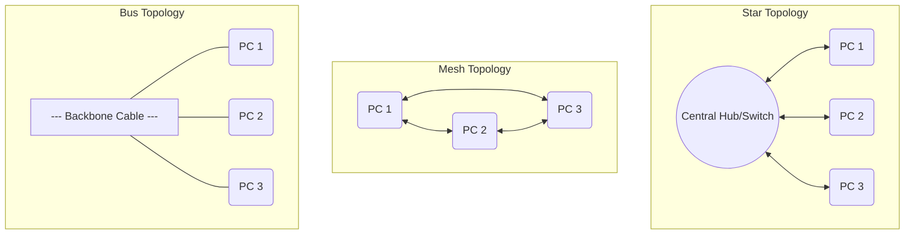
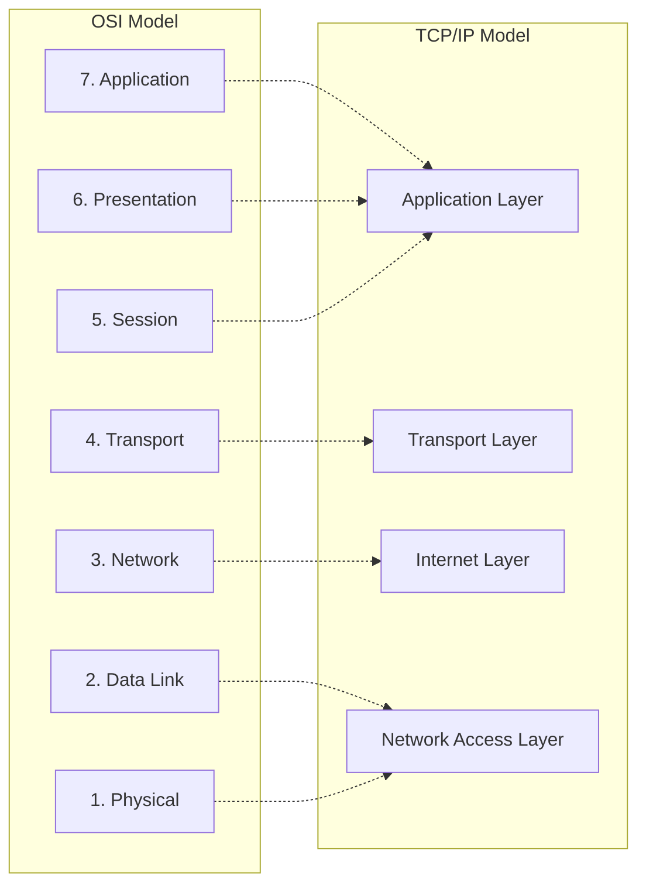
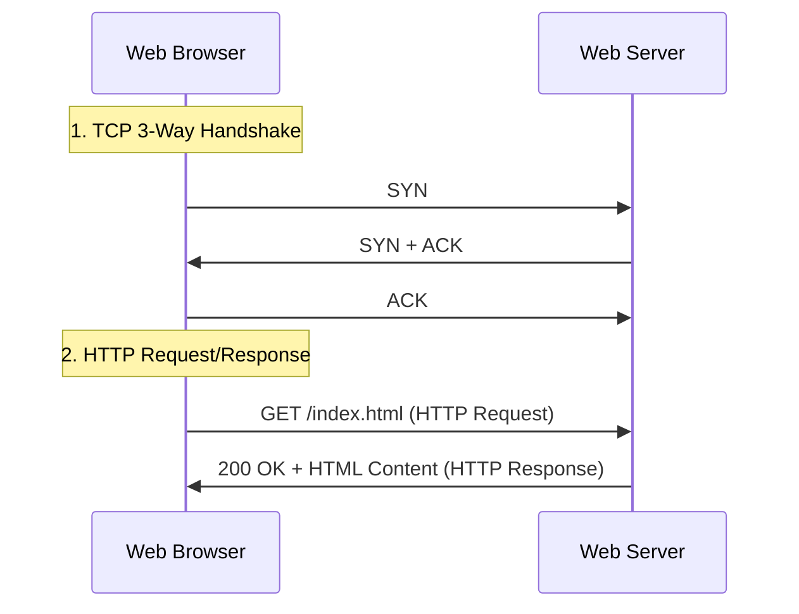

# Unit II: Computer Networking Basics

Welcome to Unit 2! This guide covers the physical structures of computer networks, the theoretical OSI and TCP/IP reference layers, the math behind Subnetting, and the protocols that power the modern web.

---

## 1. Network Topologies & Transmission Media

A **Network Topology** is the structural layout of a computer network. It defines how different nodes (computers, routers) are connected to each other.

### 1.1 Physical Topologies Compared

| Topology | Connection Pattern | Cabling & Cost | Fault Isolation | Reliability |
| :--- | :--- | :--- | :--- | :--- |
| **Mesh** | Every node is directly connected to every other node. | **Very High** (Requires $N(N-1)/2$ duplex links and $N-1$ ports per node). | Easy. (Broken link only affects its two nodes). | **Excellent**. Highly redundant. |
| **Star** | All nodes connect to a central hub or switch. | **Medium**. (Needs 1 cable per device). | Easy. If one node's link breaks, only that node is disconnected. | **Good** (But central hub is a Single Point of Failure). |
| **Bus** | Nodes share a single communication backbone cable. | **Low**. Minimal cabling. | Very difficult. | **Low**. If the backbone breaks, the entire network goes down. |
| **Ring** | Each node connects to exactly two neighbors, forming a circle. | **Medium**. Token-passing mechanism. | Hard to isolate faults. | **Low** (a single node failure breaks the entire loop). |

### 1.2 Transmission Media
*   **Guided Media (Cables)**:
    *   **Twisted Pair**: Copper wires twisted to reduce electromagnetic interference (crosstalk). e.g., Cat5e, Cat6.
    *   **Coaxial Cable**: Solid copper core wrapped in shielding. Used for cable TV and early Ethernet.
    *   **Fiber Optic**: Glass/plastic fibers that transmit data as light pulses. **Highest bandwidth**, immune to electromagnetic interference, but expensive.
*   **Unguided Media (Wireless)**:
    *   **Radio Waves**: Omnidirectional. Used for WiFi, Bluetooth, AM/FM radio.
    *   **Microwaves**: Unidirectional (line of sight). Used for cell towers and satellite communications.

---

## 2. OSI Model vs. TCP/IP Model

Reference models define standard layers that network components use to communicate.

### 2.1 OSI 7-Layer Functions
1.  **Application (Layer 7)**: Provides services directly to user applications (HTTP, FTP, SMTP).
2.  **Presentation (Layer 6)**: Translates, encrypts, and compresses data (SSL/TLS, JPEG).
3.  **Session (Layer 5)**: Manages, maintains, and synchronizes dialog connections (RPC, NetBIOS).
4.  **Transport (Layer 4)**: End-to-end delivery of data segments. Ensures reliability, flow control, and error recovery (TCP, UDP).
5.  **Network (Layer 3)**: Routes packets across multiple networks using logical addresses (IP, ICMP, ARP).
6.  **Data Link (Layer 2)**: Reliable hop-to-hop frame transmission. Handles physical addressing, framing, and access control (MAC, CSMA/CD).
7.  **Physical (Layer 1)**: Transmits raw bits over physical media (Cables, Hubs, voltage levels).

---

## 3. Subnetting & Routing

### 3.1 IP Addressing (IPv4)
An IPv4 address is a 32-bit logical address written in dotted-decimal format (e.g., `192.168.1.1`). It is divided into Classful groups:

| Class | First Octet Range | Default Subnet Mask | Use Case |
| :--- | :--- | :--- | :--- |
| **Class A** | `1 - 126` | `255.0.0.0` (/8) | Massive networks (few networks, millions of hosts) |
| **Class B** | `128 - 191` | `255.255.0.0` (/16) | Medium-large corporate networks |
| **Class C** | `192 - 223` | `255.255.255.0` (/24)| Small networks (many networks, 254 hosts per net) |

*(Note: Octet `127` is reserved for loopback testing/localhost).*

### 3.2 Subnetting Concepts
Subnetting divides a single physical network into smaller, logical sub-networks (subnets). This limits broadcast traffic and improves security.
*   **CIDR (Classless Inter-Domain Routing)**: Uses a slash notation to denote how many bits represent the network ID (e.g., `/26` means 26 network bits, leaving $32-26 = 6$ bits for hosts).

### 3.3 Routing Algorithms
Routers use algorithms to determine the best path to send packets across networks:
*   **Distance Vector Routing**:
    *   Uses **Hop Count** as the metric.
    *   Routers share their *entire* routing table periodically with *only immediate neighbors*.
    *   *Example*: RIP (Routing Information Protocol).
    *   *Issue*: Slow convergence; **Count-to-Infinity** problem.
*   **Link State Routing**:
    *   Uses complex metrics (bandwidth, delay, load) via Dijkstra's shortest path algorithm.
    *   Routers flood *link-state information* to *all routers* in the network, allowing each router to build an identical, complete map of the topology.
    *   *Example*: OSPF (Open Shortest Path First).

---

## 4. Key Application Layer Protocols

These protocols enable standard communications at the application interface:

*   **HTTP (Hypertext Transfer Protocol)**: Port 80. Used to transfer web pages. **Stateless** protocol. **HTTPS** (port 443) adds SSL/TLS encryption.
*   **SMTP (Simple Mail Transfer Protocol)**: Port 25. Used to *send* emails from clients to servers and between mail servers.
*   **POP3 (Post Office Protocol)**: Port 110. Downloads mail from server to client, deleting it from the server by default (offline mail client).
*   **IMAP (Internet Message Access Protocol)**: Port 143. Synchronizes emails dynamically between server and client (multi-device support).
*   **FTP (File Transfer Protocol)**: Ports 20 (data transfer) & 21 (control connection). Used for file sharing.
*   **DNS (Domain Name System)**: Port 53 (runs on UDP for speed, TCP for zone transfers). Resolves human-readable domain names (e.g., `google.com`) to IP addresses.
*   **DHCP (Dynamic Host Configuration Protocol)**: Ports 67 (server) & 68 (client). Dynamically assigns IP addresses, subnet masks, default gateways, and DNS settings to joining devices automatically.
    *   Uses the **DORA** process: **D**iscover $\to$ **O**ffer $\to$ **R**equest $\to$ **A**cknowledge.
