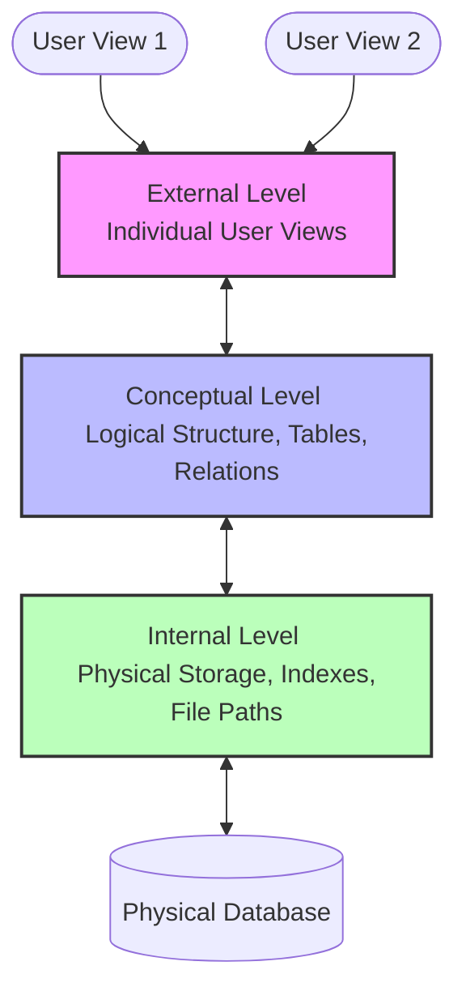
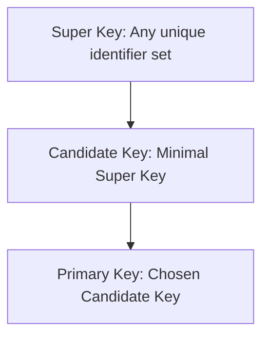
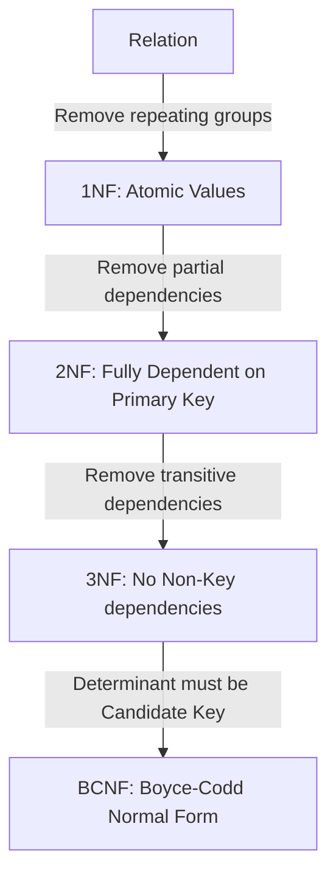
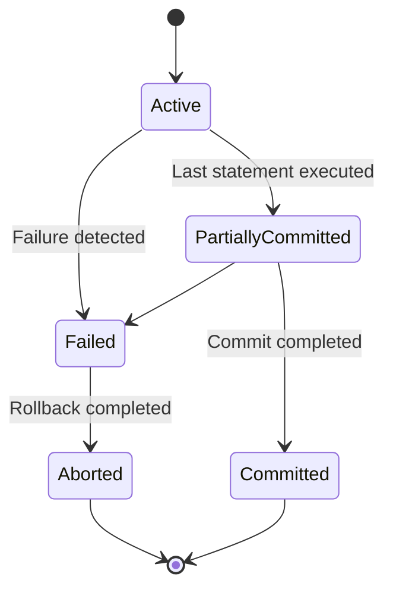

# Unit III: Database Management Systems (DBMS)

Welcome to Unit 3! This guide details database architecture, relational database keys, SQL classifications, normalization rules (up to BCNF), and the concurrency control mechanisms that maintain ACID properties.

---

## 1. Introduction to DBMS & Architecture

A **Database Management System (DBMS)** is software designed to store, retrieve, define, and manage data efficiently, replacing file-based storage systems.

### 1.1 File System vs. DBMS
*   **File System**: Data is stored in flat files. This leads to **data redundancy** (same data repeated in multiple files), **data inconsistency** (updates in one file miss others), and lack of concurrent access controls or security.
*   **DBMS**: Manages data centrally. It provides **data independence**, structural security, crash recovery, and concurrency management.

### 1.2 Three-Schema Architecture
To isolate user applications from the physical database files, the ANSI-SPARC model defines three abstraction layers:

*   **Logical Data Independence**: The ability to modify the conceptual schema (e.g., adding/modifying tables) without changing the external schemas (user views/application programs).
*   **Physical Data Independence**: The ability to modify the physical storage structure (e.g., swapping HDDs for SSDs, creating indexes) without changing the logical/conceptual schema.

---

## 2. Relational Model Terminology & Keys

In a Relational Database:
*   **Relation**: A Table.
*   **Tuple**: A Row of data (representing a single record).
*   **Attribute**: A Column of data (representing a field).
*   **Degree**: The total number of columns/attributes in a table.
*   **Cardinality**: The total number of rows/tuples currently in a table.

### 2.1 The Key Hierarchy

1.  **Super Key**: Any set of one or more attributes that, taken collectively, uniquely identifies a tuple within a relation.
2.  **Candidate Key**: A minimal super key. If you remove any attribute from it, it loses its uniqueness property.
3.  **Primary Key**: The specific candidate key chosen by the database designer to uniquely identify tuples.
    *   *Rules*: Must be **UNIQUE** and **cannot contain NULL values**.
4.  **Foreign Key**: An attribute in a table that references the primary key (or candidate key) of another table. It enforces **Referential Integrity**.
    *   *Rules*: **Can contain NULL values** (unless marked NOT NULL).

---

## 3. SQL Commands & Joins

### 3.1 SQL Categories
Structured Query Language is divided into four main functional blocks:

| Category | Full Form | Purpose | Key Commands |
| :--- | :--- | :--- | :--- |
| **DDL** | Data Definition Language | Defines, modifies, and deletes database structures (schemas, tables, indexes). | `CREATE`, `ALTER`, `DROP`, `TRUNCATE` |
| **DML** | Data Manipulation Language | Selects, inserts, updates, and deletes data inside tables. | `SELECT`, `INSERT`, `UPDATE`, `DELETE` |
| **DCL** | Data Control Language | Grants or revokes security access privileges. | `GRANT`, `REVOKE` |
| **TCL** | Transaction Control Language | Manages the execution of transactions. | `COMMIT`, `ROLLBACK`, `SAVEPOINT` |

*   **Interview Trap**: `DELETE` vs `TRUNCATE` vs `DROP`
    *   `DELETE`: DML. Row-by-row removal. Slow. Can be rolled back.
    *   `TRUNCATE`: DDL. Deletes all rows by deallocating table pages. Fast. Cannot be rolled back (in standard systems).
    *   `DROP`: DDL. Destroys both table data *and* the table schema completely.

### 3.2 SQL Joins
*   **Inner Join**: Returns records that have matching values in both tables.
*   **Left (Outer) Join**: Returns all records from the left table, and matched records from the right table (unmatched fields return `NULL`).
*   **Right (Outer) Join**: Returns all records from the right table, and matched records from the left table.
*   **Full (Outer) Join**: Returns all records when there is a match in either left or right table.

---

## 4. Database Normalization

Normalization is the process of structuring a relational database to minimize **data redundancy** and avoid **insertion, update, and deletion anomalies**.

### 4.1 Normal Forms Demystified

1.  **First Normal Form (1NF)**:
    *   *Rule*: All attribute values must be **atomic** (no repeating groups, no multi-valued attributes in a cell).
2.  **Second Normal Form (2NF)**:
    *   *Rule*: Must be in 1NF, and there must be **no partial dependencies**. 
    *   *Definition*: A partial dependency occurs when a non-prime attribute depends on only a *part* of a composite primary key. (e.g., if PK is $\{A, B\}$ and $B \to C$, then $C$ has a partial dependency on part of the key).
3.  **Third Normal Form (3NF)**:
    *   *Rule*: Must be in 2NF, and there must be **no transitive dependencies**.
    *   *Definition*: A transitive dependency occurs when $A \to B$ and $B \to C$ (where $A$ is the primary key and $B$ is a non-key attribute). Thus, a non-key attribute determines another non-key attribute ($B \to C$).
    *   *Formally*: For every non-trivial dependency $X \to Y$, either $X$ is a super key or $Y$ is a prime attribute.
4.  **Boyce-Codd Normal Form (BCNF)**:
    *   *Rule*: Strict version of 3NF. For every non-trivial functional dependency $X \to Y$, **$X$ must be a super key**.
    *   *Note*: BCNF is dependency-destroying in some cases, whereas 3NF always guarantees dependency preservation.

---

## 5. Transaction Management & Concurrency Control

A **Transaction** is a single logical unit of database work.

### 5.1 ACID Properties
*   **Atomicity**: "All or Nothing". Either the entire transaction completes, or the database is rolled back to its pre-transaction state. Managed by the **Transaction/Recovery Manager** (uses logs).
*   **Consistency**: The database must remain in a valid state before and after execution. Enforced by database constraints (primary keys, check constraints).
*   **Isolation**: Concurrent execution of transactions must leave the database in the same state as if they were run sequentially. Managed by the **Concurrency Control Manager** (using locks).
*   **Durability**: Once committed, changes are permanent and survive system crashes. Managed by the **Recovery Manager** (non-volatile storage write-ahead logs).

### 5.2 Transaction States

### 5.3 Concurrency Control: Two-Phase Locking (2PL)
To ensure serializability, transactions use locks. **Two-Phase Locking (2PL)** requires transactions to lock resources in two distinct phases:
1.  **Growing Phase**: Transaction can acquire locks but cannot release any.
2.  **Shrinking Phase**: Transaction can release locks but cannot acquire any new ones.

*   *Note*: 2PL guarantees conflict serializability, but **does not prevent deadlocks** (transactions can wait on each other's locks forever).
