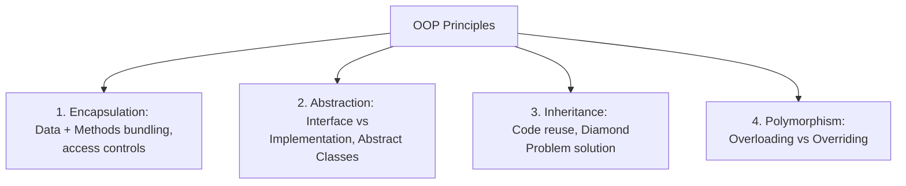
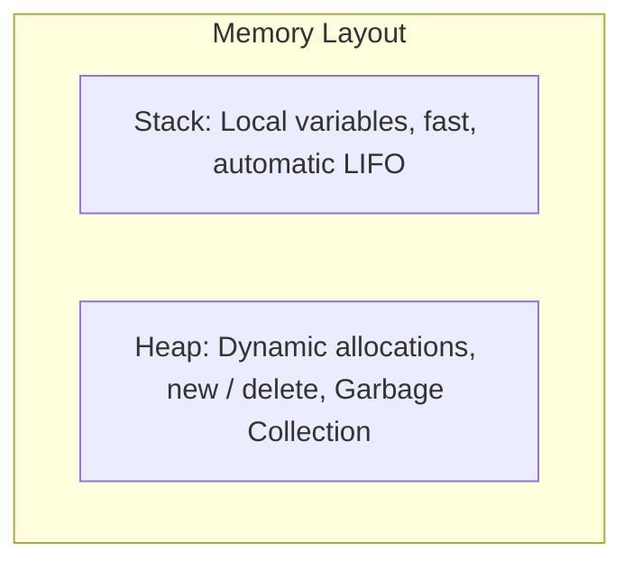

# Unit IV: Fundamentals of Programming Languages

Welcome to Unit 4! This guide provides a conceptual overview of programming language paradigms, comparing C, C++, and Java. We will delve into Pointers, Storage Classes, Object-Oriented Programming (OOP) mechanics, Parameter Passing, and Memory Management.

---

## 1. C vs. C++ vs. Java: Core Architectural Differences

| Feature | C | C++ | Java |
| :--- | :--- | :--- | :--- |
| **Paradigm** | Procedural / Imperative. | Multi-paradigm (Procedural + OOP). | Pure Object-Oriented (mostly). |
| **Execution** | Compiled directly to native machine code. | Compiled directly to native machine code. | Compiled to **Bytecode**; executed by the **JVM** (interpreted + JIT). |
| **Platform** | Platform Dependent (binary runs only on target OS). | Platform Dependent. | **Platform Independent** ("Write Once, Run Anywhere"). |
| **Pointers** | Supported (direct memory manipulation). | Supported. | Hidden (no pointer arithmetic, uses references). |
| **Memory** | Manual (`malloc`/`free`). | Manual (`new`/`delete`, RAII). | Automatic (**Garbage Collection**). |
| **Inheritance** | None. | Multiple inheritance allowed. | Single class inheritance (multiple via Interfaces). |

---

## 2. Pointers & Storage Classes

### 2.1 Pointers & Reference Variables
A **Pointer** is a variable that stores the physical memory address of another variable.
*   **Declaring & Dereferencing**:
    ```cpp
    int x = 10;
    int *ptr = &x;  // 'ptr' stores the address of 'x'
    *ptr = 20;      // Dereferencing: Updates 'x' to 20
    ```
*   **Double Pointer**: A pointer that stores the address of another pointer (`int **dptr = &ptr;`).
*   **C++ Reference Variable**: An alias to an existing variable. It must be initialized when declared and cannot be changed to reference another variable.
    ```cpp
    int x = 10;
    int &ref = x;  // 'ref' is an alias for 'x'
    ```

### 2.2 Storage Classes in C/C++
Storage classes define the scope (visibility), linkage, lifetime, and storage location of variables.

| Storage Class | Location | Default Value | Scope | Lifetime |
| :--- | :--- | :--- | :--- | :--- |
| **`auto`** | Stack | Garbage value | Local (block) | Block entry to exit |
| **`register`** | CPU Register | Garbage value | Local (block) | Block entry to exit |
| **`static`** | RAM (Data Segment) | `0` | Local (block) | Program start to end |
| **`extern`** | RAM (Data Segment) | `0` | Global | Program start to end |

*   **`static` Local Variable**: Retains its value between function calls. It is initialized only once.
*   **`register` Variable**: Suggests the compiler store the variable in a CPU register for speed (cannot take address using `&` in C, allowed in C++).

---

## 3. Object-Oriented Programming (OOP) Principles

OOP organizes software design around data (objects) rather than functions/logic.

### 3.1 The 4 Pillars of OOP



1.  **Encapsulation**: Bundling data variables and methods together into a single unit (Class) and restricting direct access using access modifiers (`private`, `protected`, `public`). This is also known as **Data Hiding**.
2.  **Abstraction**: Hiding background implementation details and exposing only the essential interface to the user. Achieved via **Abstract Classes** (must contain at least one pure virtual function in C++) and **Interfaces** (all abstract methods).
3.  **Inheritance**: The mechanism where a new class (derived/child) inherits attributes and methods of an existing class (base/parent).
    *   **The Diamond Problem**: Occurs in multiple inheritance when a class inherits from two classes that both inherit from a single grandparent class, creating ambiguity.
        *   *C++ Solution*: Virtual Inheritance (`class B : virtual public A`).
        *   *Java Solution*: Disallows multiple class inheritance; implements multiple interfaces instead.
4.  **Polymorphism**: "Many forms".
    *   **Compile-time (Static) Polymorphism**: Method/Operator Overloading. Same method name, different parameter signature. Resolved at compile-time.
    *   **Runtime (Dynamic) Polymorphism**: Method Overriding. Child class redefines a parent method. Resolved at runtime using **Virtual Tables (VTABLEs)** and **Virtual Pointers (VPTRs)** in C++.

---

## 4. Parameter Passing & Binding

### 4.1 Parameter Passing Techniques

#### Pass by Value
Creates a copy of the actual argument inside the function stack. Modifying the parameter inside the function has no effect on the original argument.
```cpp
void swap(int a, int b) {
    int temp = a; a = b; b = temp;
} // swap(x, y) won't modify x or y
```

#### Pass by Address (Pointer)
Passes the memory address of the argument. Dereferencing modifies the original variable.
```cpp
void swap(int *a, int *b) {
    int temp = *a; *a = *b; *b = temp;
} // swap(&x, &y) modifies x and y
```

#### Pass by Reference
Passes an alias of the argument. Syntactically cleaner than pointers while modifying the original variable.
```cpp
void swap(int &a, int &b) {
    int temp = a; a = b; b = temp;
} // swap(x, y) modifies x and y
```

### 4.2 Static vs. Dynamic Binding
*   **Static (Early) Binding**: The compiler links function calls to their definitions at compile time. Normal function calls, overloaded methods, and static methods are early bound.
*   **Dynamic (Late) Binding**: Function resolution occurs at runtime. Enabled using virtual functions in C++ or overridden instance methods in Java.

---

## 5. Memory Handling in OOP Languages

Programs utilize two main areas of RAM during execution:
*   **Stack**: Stores local variables, parameter values, and return addresses. Allocation is automatic, fast, and follows LIFO ordering.
*   **Heap**: Used for dynamic memory allocation. Memory remains allocated until manually released or garbage collected.



### 5.1 C++ Manual Memory Management
*   **Allocation**: Use `new` or `new[]`.
*   **Deallocation**: Use `delete` or `delete[]`.
*   **Issue**: Forgetting to call `delete` leads to **Memory Leaks** (RAM remains allocated but unreachable). Calling delete twice on the same pointer causes a **Double Free** crash.
*   **RAII & Smart Pointers**: Modern C++ uses smart pointers (`std::unique_ptr`, `std::shared_ptr`) to automatically release heap memory when pointers go out of scope.

### 5.2 Java Automatic Memory Management (JVM)
*   Java allocates objects on the heap using `new` but does not have a `delete` keyword.
*   **Garbage Collector (GC)** runs in the background, identifying objects that are no longer reachable from any active stack references and reclaiming their memory automatically.
*   **Mark-and-Sweep Algorithm**:
    1.  **Mark**: Traverse reference chains starting from GC roots and mark all reachable objects.
    2.  **Sweep**: Scans the heap and releases memory for all unmarked (unreachable) objects.
