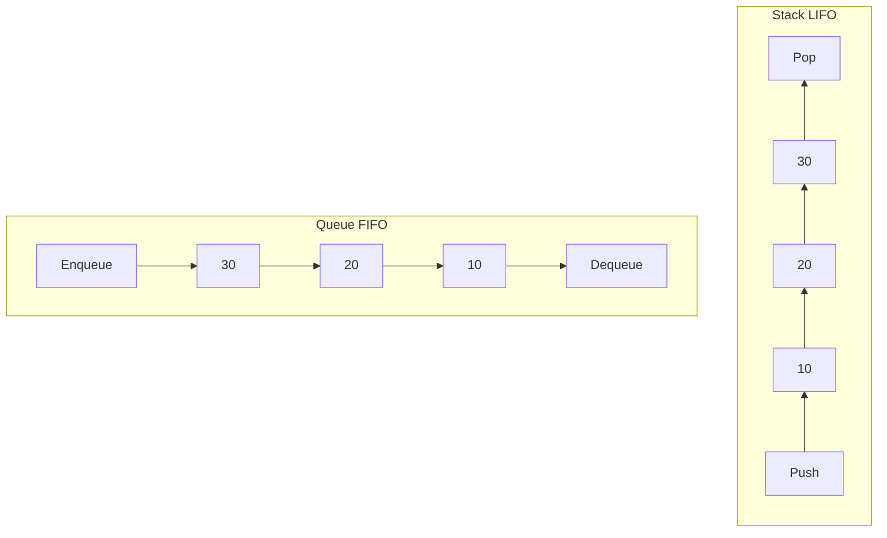
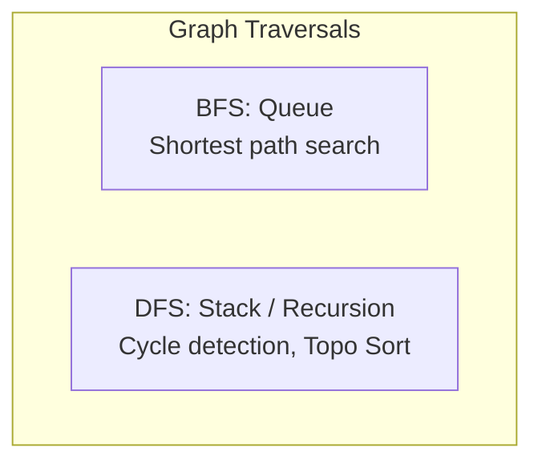

# Unit V: Data Structures

Welcome to Unit 5! This guide details linear data structures (Arrays, Linked Lists, Stacks, Queues) and non-linear data structures (Trees, Graphs), along with performance-boosting concepts like Hashing and Heaps.

---

## 1. Linear Data Structures: Arrays & Linked Lists

A **Linear Data Structure** arranges data elements sequentially or linearly, where each element is attached to its previous and next adjacent elements.

### 1.1 Arrays vs. Linked Lists
*   **Array**: A collection of elements stored in **contiguous memory locations**.
    *   *Pro*: **$O(1)$ Random Access** (using index calculations). Good CPU cache locality.
    *   *Con*: **Fixed Size** (determined at compilation/allocation). Insertion and deletion require shifting elements ($O(N)$ worst-case).
*   **Linked List**: A collection of nodes containing data and pointers. Nodes are stored in **non-contiguous memory locations**.
    *   *Pro*: **Dynamic Size** (grows and shrinks at runtime). Insertion/deletion at a known node position is extremely fast ($O(1)$).
    *   *Con*: **$O(N)$ Sequential Access** (must traverse from head node). High memory overhead due to pointer storage. Poor cache locality.

```mermaid
graph LR
    subgraph Array
        A0[Index 0] <--> A1[Index 1] <--> A2[Index 2]
    end
    subgraph Singly Linked List
        L0[Head: Data|Next] --> L1[Data|Next] --> L2[Data|NULL]
    end
```

### 1.2 Linked List Variants
*   **Singly Linked List (SLL)**: Each node points to the next node. The last node points to `NULL`.
*   **Doubly Linked List (DLL)**: Each node contains two pointers: `next` (points to the next node) and `prev` (points to the previous node). Enables bidirectional traversal.
*   **Circular Linked List**: The last node points back to the first node (Head), forming a closed ring.

---

## 2. Stacks & Queues

Both Stacks and Queues are restricted linear data structures where insertions and deletions occur at specific endpoints.



### 2.1 Stacks (LIFO - Last In First Out)
*   **Mechanism**: Elements are inserted (**Push**) and removed (**Pop**) from the same endpoint, called the **Top**.
*   **Errors**:
    *   *Stack Overflow*: Trying to push an element onto a full stack.
    *   *Stack Underflow*: Trying to pop an element from an empty stack.
*   **Applications**: Recursion/system call stack, Undo/Redo operations, Expression parsing (Infix to Postfix/Prefix) and evaluation.

### 2.2 Queues (FIFO - First In First Out)
*   **Mechanism**: Elements are inserted (**Enqueue**) at the **Rear** and removed (**Dequeue**) from the **Front**.
*   **Variants**:
    *   *Circular Queue*: The last position connects to the first position to reuse deallocated space.
    *   *Double-Ended Queue (Deque)*: Allows insertion and deletion at both Front and Rear.
    *   *Priority Queue*: Elements are dequeued based on priority rather than arrival order.
*   **Applications**: Job scheduling (FCFS CPU scheduling), IO buffers, breadth-first search (BFS) graph traversals.

---

## 3. Trees (Binary Trees & Balanced Trees)

A **Tree** is a hierarchical, non-linear data structure consisting of nodes connected by edges, containing no cycles.

### 3.1 Binary Search Tree (BST)
*   **Rule**: For every node, all values in its **left subtree** must be less than the node's value, and all values in its **right subtree** must be greater.
*   **Complexity**: $O(\log N)$ average search/insert/delete, degrading to $O(N)$ in the worst-case (skewed tree).

### 3.2 Balanced Trees
To prevent trees from skewing (which degrades search times to $O(N)$), we use self-balancing BSTs:
*   **AVL Tree**: A self-balancing BST where the height difference (**Balance Factor**) between the left and right subtrees of any node is at most $\pm 1$.
    *   $$\text{Balance Factor} = \text{Height}(Left Subtree) - \text{Height}(Right Subtree)$$
    *   Uses **Rotations** (LL, RR, LR, RL) to restore balance after insertions/deletions.
*   **Red-Black Tree**: A self-balancing BST that uses a color property (red or black) on nodes to maintain structural balance. (e.g., used to implement standard library maps/sets).
*   **B-Tree / B+ Tree**: Multi-way search trees optimized for secondary storage systems. They keep disk read operations to a minimum by storing many keys in a single large node, which is ideal for database indexes.

### 3.3 Tree Traversals
*   **Inorder (Left $\to$ Root $\to$ Right)**: Traversing a BST inorder yields values in **sorted order**.
*   **Preorder (Root $\to$ Left $\to$ Right)**: Used to create copies of a tree.
*   **Postorder (Left $\to$ Right $\to$ Root)**: Used for deleting a tree.
*   **Level Order (BFS)**: Visits nodes level-by-level starting from the root.

---

## 4. Graphs

A **Graph** is a set of vertices (nodes) connected by edges.

*   **Representations**:
    *   *Adjacency Matrix*: A 2D array of size $V \times V$. Cell $[i][j] = 1$ if an edge exists from $i$ to $j$.
        *   *Pros*: Fast edge check ($O(1)$).
        *   *Cons*: High space overhead ($O(V^2)$), regardless of whether the graph is sparse or dense.
    *   *Adjacency List*: An array of lists of size $V$. List $i$ contains all vertices adjacent to $i$.
        *   *Pros*: Space-efficient ($O(V+E)$) for sparse graphs.
        *   *Cons*: Slow edge check ($O(V)$).



---

## 5. Hashing

Hashing maps data keys of arbitrary size to a fixed index range using a **Hash Function**.

*   **Collision**: Occurs when two distinct keys map to the exact same hash table index.
*   **Collision Resolution**:
    1.  **Separate Chaining**: Each slot in the hash table points to a linked list containing all colliding records. (Load factor $\alpha$ can exceed $1.0$).
    2.  **Open Addressing**: Colliding keys are placed in another slot within the table. (Load factor $\alpha \le 1.0$).
        *   *Linear Probing*: Look at index $h(x), h(x)+1, h(x)+2, \dots$
        *   *Quadratic Probing*: Look at index $h(x) + c_1i + c_2i^2$ for step $i$.
        *   *Double Hashing*: Use a second hash function: $h(x, i) = (h_1(x) + i \cdot h_2(x)) \pmod m$.

---

## 6. Heaps

A **Heap** is a complete binary tree stored inside a contiguous array.

```
Array representation index mapping:
- If a parent node is at index i:
  - Left Child:  index 2*i  (1-indexed)
  - Right Child: index 2*i + 1
  - Parent:      index i/2
```

*   **Min-Heap**: The value of each node is greater than or equal to the value of its parent. The minimum element is always at the root (index 1).
*   **Max-Heap**: The value of each node is less than or equal to the value of its parent. The maximum element is always at the root.
*   **Key Complexities**:
    *   *Heapify*: $O(\log N)$
    *   *Build Heap*: $O(N)$
    *   *Insertion / Extract-Min*: $O(\log N)$
    *   *Heapsort*: $O(N \log N)$
