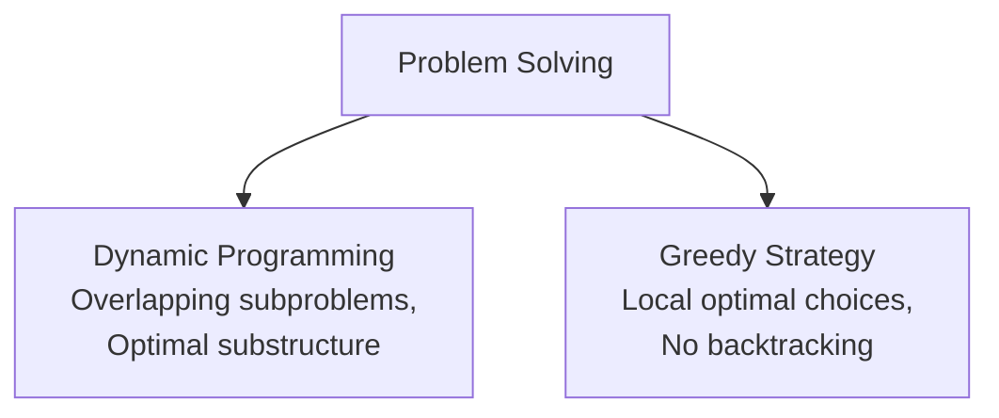

# Unit VI: Algorithms

Welcome to Unit 6! This guide covers time and space complexities, mathematical recurrence solvers (Master Theorem), sorting analysis, and key algorithmic paradigms: Divide & Conquer, Dynamic Programming, and Greedy Algorithms.

---

## 1. Algorithm Analysis & Asymptotic Notations

An **Algorithm** is a step-by-step procedure to solve a problem in finite time. To analyze algorithms independently of hardware, we measure how their execution time or memory footprint grows with input size $N$.

### 1.1 Asymptotic Notations
*   **Big-O Notation ($O$)**: Represents the mathematical **upper bound** (worst-case scenario).
    *   $$T(N) = O(f(N)) \iff \exists c > 0, N_0 > 0 \text{ s.t. } 0 \le T(N) \le c \cdot f(N) \quad \forall N \ge N_0$$
*   **Big-Omega Notation ($\Omega$)**: Represents the **lower bound** (best-case scenario).
    *   $$T(N) = \Omega(f(N)) \iff \exists c > 0, N_0 > 0 \text{ s.t. } 0 \le c \cdot f(N) \le T(N) \quad \forall N \ge N_0$$
*   **Big-Theta Notation ($\Theta$)**: Represents the **tight bound** (average-case scenario).
    *   $$T(N) = \Theta(f(N)) \iff c_1 \cdot f(N) \le T(N) \le c_2 \cdot f(N) \quad \forall N \ge N_0$$

### 1.2 Rate of Growth Hierarchy
When evaluating time complexities, algorithms are ordered from fastest (best) to slowest (worst):

$$\mathbf{O(1) < O(\log N) < O(N) < O(N \log N) < O(N^2) < O(2^N) < O(N!)}$$

---

## 2. Recurrences & The Master Theorem

Recurrence relations define the execution times of recursive divide-and-conquer algorithms. The **Master Theorem** solves recurrences of the form:

$$T(N) = aT(N/b) + f(N) \quad \text{where } a \ge 1, b > 1$$

We compare $f(N)$ with $N^{\log_b a}$:

*   **Case 1**: If $f(N) = O(N^{\log_b a - \epsilon})$ for some $\epsilon > 0$, then:
    $$T(N) = \Theta(N^{\log_b a})$$
*   **Case 2**: If $f(N) = \Theta(N^{\log_b a} \log^k N)$ for $k \ge 0$, then:
    $$T(N) = \Theta(N^{\log_b a} \log^{k+1} N)$$
*   **Case 3**: If $f(N) = \Omega(N^{\log_b a + \epsilon})$ for some $\epsilon > 0$, and if $a \cdot f(N/b) \le c \cdot f(N)$ for some $c < 1$, then:
    $$T(N) = \Theta(f(N))$$

### 2.1 Core Recurrences Solving Examples
*   **Binary Search**: $T(N) = T(N/2) + \Theta(1)$
    *   $a=1, b=2 \implies N^{\log_2 1} = N^0 = 1$. Since $f(N) = 1$ (Case 2 with $k=0$):
    *   $$T(N) = \Theta(\log N)$$
*   **Merge Sort**: $T(N) = 2T(N/2) + \Theta(N)$
    *   $a=2, b=2 \implies N^{\log_2 2} = N^1 = N$. Since $f(N) = N$ (Case 2 with $k=0$):
    *   $$T(N) = \Theta(N \log N)$$

---

## 3. Sorting Algorithms Analysis

Sorting algorithms are evaluated based on their complexity, **space requirements (in-place vs. out-of-place)**, and **stability**.
*   **Stable Sorting**: Preserves the relative order of duplicate keys.
*   **In-place Sorting**: Requires a constant amount of auxiliary memory ($O(1)$ extra space).

| Sorting Algorithm | Best Case | Average Case | Worst Case | Space Complexity | Stable? | In-Place? |
| :--- | :--- | :--- | :--- | :--- | :--- | :--- |
| **Bubble Sort** | $O(N)$ | $O(N^2)$ | $O(N^2)$ | $O(1)$ | Yes | Yes |
| **Selection Sort** | $O(N^2)$ | $O(N^2)$ | $O(N^2)$ | $O(1)$ | No | Yes |
| **Insertion Sort** | $O(N)$ | $O(N^2)$ | $O(N^2)$ | $O(1)$ | Yes | Yes |
| **Merge Sort** | $O(N \log N)$ | $O(N \log N)$ | $O(N \log N)$ | $O(N)$ | Yes | No |
| **Quick Sort** | $O(N \log N)$ | $O(N \log N)$ | $O(N^2)$ | $O(\log N)$ | No | Yes |
| **Heap Sort** | $O(N \log N)$ | $O(N \log N)$ | $O(N \log N)$ | $O(1)$ | No | Yes |

*   *Note*: Quick Sort degrades to $O(N^2)$ in the worst case if the pivot is chosen naively (e.g., picking the first element of an already sorted array).

---

## 4. Algorithmic Paradigms: Dynamic Programming vs. Greedy

### 4.1 Dynamic Programming (DP)
Dynamic Programming is used when a problem can be broken down into subproblems, which are solved recursively and their results are stored to avoid redundant calculations.
*   **Core Properties**:
    1.  **Optimal Substructure**: The optimal solution to a problem contains within it optimal solutions to its subproblems.
    2.  **Overlapping Subproblems**: Recursive calls visit the same subproblems repeatedly (unlike Divide & Conquer, where subproblems are independent).
*   **Implementations**:
    *   **Memoization (Top-down)**: Write the solution recursively, and store results in a lookup table (cache) before returning.
    *   **Tabulation (Bottom-up)**: Build the solution iteratively from base cases up, filling a table.
*   *Key Examples*: Floyd-Warshall (all-pairs shortest paths), Matrix Chain Multiplication, Longest Common Subsequence (LCS), 0/1 Knapsack.

### 4.2 Greedy Algorithms
Greedy algorithms solve optimization problems by making the **locally optimal choice** at each step, hoping it will lead to a globally optimal solution.
*   *Pros*: Fast, simple, and require minimal memory.
*   *Cons*: Do not guarantee optimal solutions for all problems (e.g., fails for 0/1 Knapsack, but works for Fractional Knapsack).
*   *Key Examples*: Huffman Coding (lossless data compression), Dijkstra's algorithm (single-source shortest paths on positive-weight graphs), Kruskal's and Prim's algorithms (Minimum Spanning Trees - MST).
