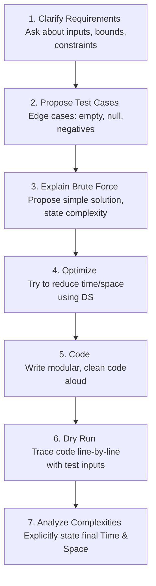

# Unit VII: Technical Interview Preparation Kit

Welcome to Unit 7! This guide covers the non-technical and tactical strategies essential for success in technical interviews, including Resume Building, Communication Strategies, Whiteboard Coding workflows, Behavioral Interviewing (STAR method), and target preparation for Service-Oriented IT companies.

---

## 1. Technical Resume Building

Your resume is a marketing document designed to pass **Applicant Tracking Systems (ATS)** and secure an interview.

### 1.1 Structural Guidelines
1.  **Format**: Keep it to a single page (unless you have 5+ years of experience). Use a single-column, clean, non-templated layout that ATS parsers can read easily.
2.  **Contact Info**: Name, Phone, Professional Email, GitHub link, and LinkedIn profile.
3.  **Skills Section**: Group skills logically (e.g., *Languages*: C++, Java, SQL; *Data Structures*: Trees, Graphs; *Tools*: Git, Docker).
4.  **Projects Section**: Highlight 2-3 significant projects. For each project, write 2-3 bullet points using the **X-Y-Z formula**:
    *   *"Accomplished [X], as measured by [Y], by doing [Z]."*
    *   *Example*: *"Optimized database queries [X] by 40% [Y] through the implementation of B+ Tree indexing and query refactoring [Z]."*
5.  **Experience / Education**: List in reverse chronological order. Include degree, university, GPA (if > 3.0), and graduation year.

---

## 2. Communication & Whiteboard Coding Workflows

A technical interview is not just a coding test; it is a **collaborative design session**. The interviewer wants to know what it is like to work with you.

### 2.1 The Whiteboard Coding Workflow
Never start writing code immediately after hearing a problem. Follow this step-by-step process:

### 2.2 Key Communication Rules
*   **Think Aloud**: Explain your thought process continuously. If you are silent for more than 30 seconds, the interviewer cannot evaluate your problem-solving skills.
*   **Clarify**: Ask questions like: *"Are the input integers positive only?"*, *"Is the array sorted?"*, *"How should we handle null inputs?"*
*   **Acknowledge Feedback**: If the interviewer hints at a bug, do not get defensive. Stop, trace your code, and correct it.

---

## 3. Behavioral Interviews: The STAR Method

Behavioral questions (e.g., *"Tell me about a time you had a conflict with a team member"*) are used to evaluate soft skills and cultural fit. Always structure your responses using the **STAR method**:

| Component | Purpose | Details |
| :--- | :--- | :--- |
| **S - Situation** | Set the scene. | Provide context about the project, team, or challenge. |
| **T - Task** | Describe the challenge. | Define what your responsibility was in that situation. |
| **A - Action** | Explain what you did. | Focus on *your* actions, decisions, and leadership (use "I", not "we"). |
| **R - Result** | Detail the outcome. | Share the metrics-driven, successful results. Focus on what you learned. |

### 3.1 Example Behavioral Response
*Question: "Tell me about a time you had to solve a difficult technical bug under a tight deadline."*

*   **Situation**: During our university database project, our team's SQL query times jumped to 10 seconds just two days before the final submission.
*   **Task**: I was responsible for the database layer and had to identify and fix the performance bottleneck without altering the database schema.
*   **Action**: I analyzed the query execution plans and realized we were performing nested loops on unindexed foreign keys. I manually created clustered indexes on primary keys and added secondary indexes on the foreign key columns.
*   **Result**: The query runtime dropped from 10 seconds to 50 milliseconds, ensuring our team received an A grade on the project.

---

## 4. Service-Oriented IT Company Preparation

Companies like TCS, Infosys, Wipro, and Cognizant have specific hiring patterns.

### 4.1 Typical Recruitment Process
1.  **Aptitude Test**: Quantitative ability, logical reasoning, and verbal skills.
2.  **Technical MCQ Round**: Core CS concepts (OS scheduling, OSI layers, Normalization, SQL Joins, OOP basics, and basic pseudocode tracing).
3.  **Coding Round**: Basic implementation tasks (e.g., string reversals, array manipulations, prime checks, matrix additions).
4.  **Technical & HR Interview**: Tracing code, explaining projects on your resume, explaining differences (e.g., `interface` vs `abstract class`), and situational questions.

### 4.2 High-Yield Technical Topics to Target
*   **DBMS/SQL**: Know how to write Joins, `GROUP BY` with `HAVING`, and explain 1NF, 2NF, 3NF.
*   **OOP**: Be ready to define and write examples of Encapsulation, Inheritance, Overloading, and Overriding.
*   **Data Structures**: Implement a Singly Linked List, Stack (using array), and binary tree traversals.
*   **Linux/Shell**: Know basic commands (`chmod`, `grep`, `ps`, `ls`, file permissions).
